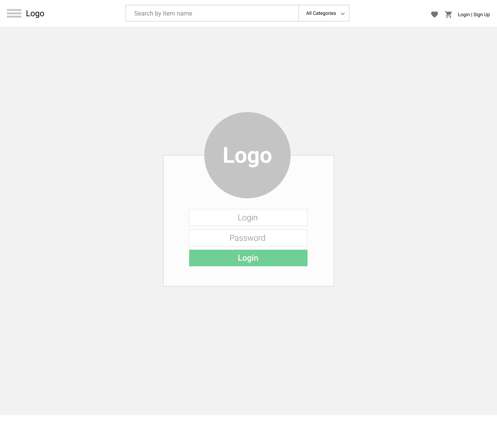
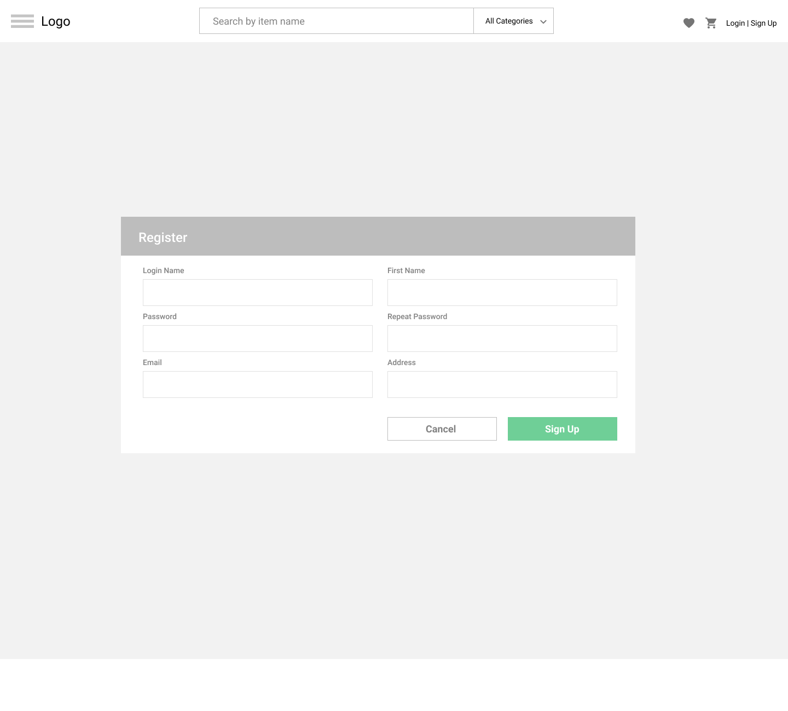
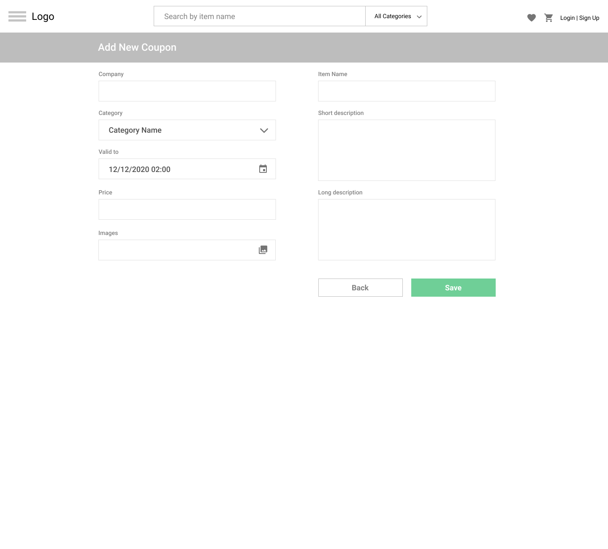
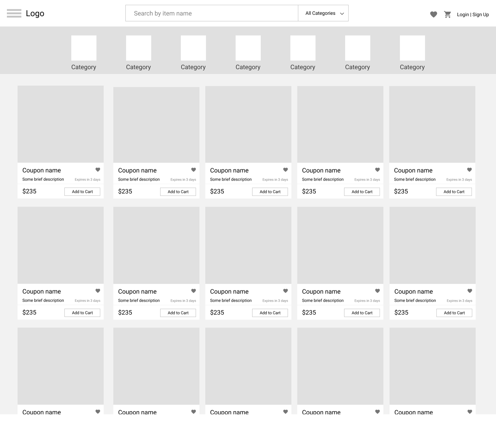
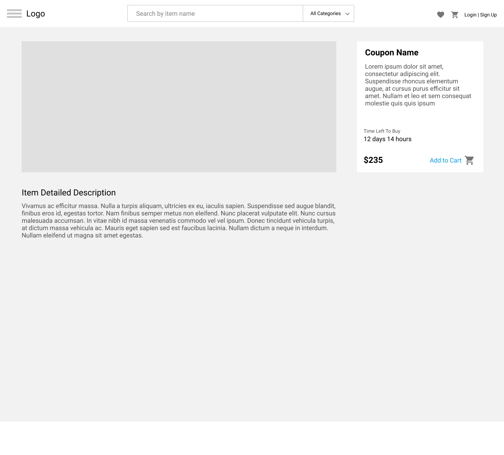
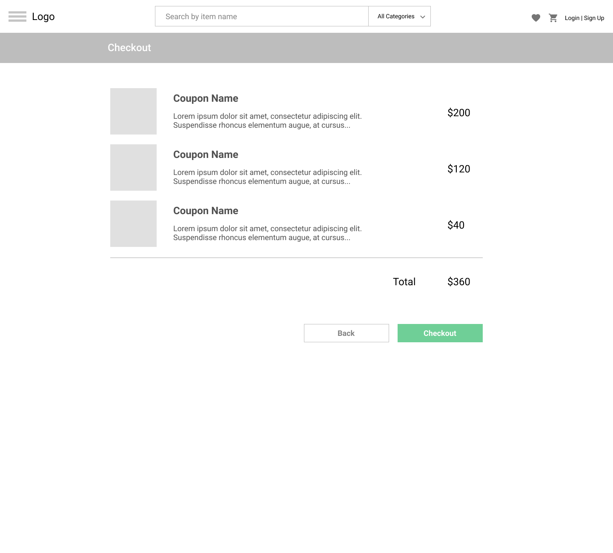

TODO: image resize XS, M, XL(200,300,600)
TODO: get by like from server
TODO: modal response showMessage() instead console

# External Lab
## UI:
### HTML & CSS

## Task 3 Angular
#### Init
ng --version
ng new store

#### Build source profiler prod
npm run build -- --prod

### Remote Deploy
https://gift-store.onrender.com/api/
switch host in index.js

### Figma
https://www.figma.com/file/VxW7bN2LwE1rNTPONhmpEb/Lab?type=design&node-id=6-413&mode=design&t=4etM9aREBil1JpqO-0

### SCSS

#### Automatically watch for changes and compile to CSS
`sass --watch build-all-styles.scss:../../css/styles.css`

#### Generate login CSS
`sass build-login.scss:../../css/login.css`

#### Generate register CSS
`sass build-register.scss:../../css/register.css`

#### Generate checkout CSS
`sass build-checkout.scss:../../css/checkout.css`

#### Generate details CSS
`sass build-details.scss:../../css/details.css`

#### Generate new coupon CSS
`sass build-newcoupon.scss:../../css/newcoupon.css`

#### Generate coupons CSS
`sass build-coupons.scss:../../css/coupons.css`

#### Generate all CSS
`sass build-login.scss:../../css/login.css && sass build-register.scss:../../css/register.css && sass build-checkout.scss:../../css/checkout.css && sass build-details.scss:../../css/details.css && sass build-newcoupon.scss:../../css/newcoupon.css && sass build-coupons.scss:../../css/coupons.css`

## Task 2

Based on a previously created HTML template you need to add some  interactive elements to your page:
1. Before implementation create empty project and copy a practical task from this module
2. Infinite items (certificates) scroll
3. Search by name, description and tags
4. Scroll back to top button
5. Feature to return to the last scroll position on the page

### Application requirements

1. Save all data in the local storage
2. Data is ordered by creation date by default, newly added item should be on the top
3. Perform search by clicking on the tag or when user stop typing in the input
4. DOM manipulation should be performed on native js
5. Use `_.debounce()` or `_.throttle()` for scroll event handler to optimize your api requests in the future

#### User Login

#### Register

#### Add New Item

#### Main Page

#### Item Details

#### Checkout

